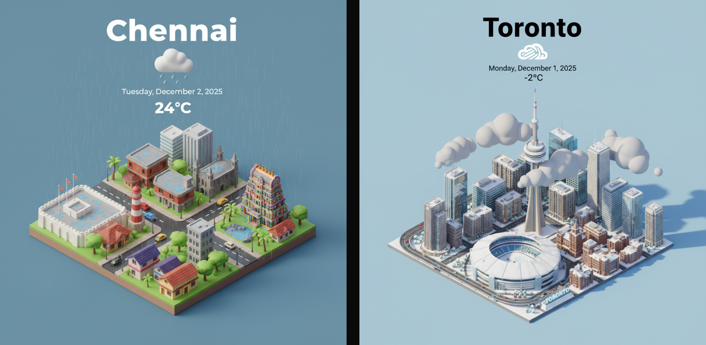

# SkyTile 🌤️

A beautiful, modern weather visualization app that transforms real-time weather data into stunning AI-generated isometric 3D city scenes. Experience any city in the world through art powered by Google Gemini.


*Demo: Compare two cities side-by-side to see weather differences in real-time*

[](CONTRIBUTING.md)

## ✨ Features

### 🌍 Real-time Weather Data
- Live weather from **Open-Meteo** (completely free, no API key required!)
- Accurate local timezone support for cities worldwide
- Temperature, conditions, humidity, wind speed, and more

### 🎨 AI-Generated Isometric Scenes
- Stunning 3D visualizations powered by **Google Gemini**
- City landmarks and architecture integrated with current weather
- Dynamic weather icons and atmospheric effects
- Beautiful glassmorphism UI with smooth animations

### 🚀 Unique UX Features

#### 🌐 **World Tour (Teleport)**
Instantly teleport to a random city and see its weather visualized. Perfect for discovering new places!

#### 🔀 **Climate Contrast (Compare Cities)**
Side-by-side comparison of two cities. See how weather differs across the globe in real-time.


### 📱 Modern Design
- Fully responsive - works beautifully on all devices
- Glassmorphism effects with gradient overlays
- Smooth animations and transitions
- Dark theme optimized for visual content

### 🎁 Easter Egg
Double-click "Gemini 3" in the footer to reveal the AI prompt used for image generation!

## 🚀 Quick Start

### Prerequisites

- Node.js 18+ and npm/yarn/pnpm
- Google API key (for AI image generation) - [Get one here](https://aistudio.google.com/app/apikey)

### Installation

1. **Clone the repository**
   ```bash
   git clone https://github.com/RamAnanth/skytile.git
   cd skytile
   ```

2. **Install dependencies**
   ```bash
   npm install
   # or
   yarn install
   # or
   pnpm install
   ```

3. **Set up environment variables**
   
   Copy the example environment file:
   ```bash
   cp .env.example .env.local
   ```
   
   Then edit `.env.local` and add your Google API key:
   ```env
   GOOGLE_API_KEY=your_google_api_key_here
   GOOGLE_MODEL=gemini-2.5-flash-image  # Optional: use 'gemini-3-pro-preview' for better quality
   ```

4. **Run the development server**
   ```bash
   npm run dev
   # or
   yarn dev
   # or
   pnpm dev
   ```

5. **Open your browser**
   
   Navigate to [http://localhost:3000](http://localhost:3000)

## 📖 How It Works

1. **Search or Select a City** - Use the search bar or pick from featured cities
2. **View Real-time Weather** - See current conditions with accurate local time
3. **Generate AI Scene** - Create a beautiful isometric visualization (requires Google API key)
4. **Compare Cities** - Switch to compare mode to see two cities side-by-side
5. **Teleport** - Click the teleport button to randomly explore cities worldwide

## 🏗️ Project Structure

```
skytile/
├── app/
│   ├── api/
│   │   ├── weather/
│   │   │   └── route.ts          # Open-Meteo weather API integration
│   │   └── generate/
│   │       └── route.ts          # Google Gemini image generation
│   ├── page.tsx                  # Main UI component
│   ├── layout.tsx                # Root layout
│   └── globals.css               # Global styles
├── components/
│   └── CitySelector.tsx          # City search and selection
├── lib/
│   ├── cities.ts                 # Predefined cities database
│   └── prompt.ts                 # AI prompt builder
├── .env.example                  # Environment variables template
└── README.md                     # This file
```

## 🔧 Configuration

### Environment Variables

| Variable | Required | Default | Description |
|----------|----------|---------|-------------|
| `GOOGLE_API_KEY` | Yes* | - | Google Gemini API key for image generation |
| `GOOGLE_MODEL` | No | `gemini-2.5-flash-image` | Gemini model to use (`gemini-3` for better quality) |

*Required only for AI image generation. Weather data works without it!

### Google Gemini Models

- **`gemini-2.5-flash-image`** (default) - Fast and cost-effective
- **`gemini-3`** - Higher quality, better results (recommended for production)

## 🌐 Deployment

### Vercel (Recommended)

1. Push your code to GitHub
2. Import your repository on [Vercel](https://vercel.com)
3. Add your `GOOGLE_API_KEY` in the environment variables section
4. Deploy! 🚀


## 💰 Cost Considerations

### Free Tier
- **Open-Meteo**: Completely free, no limits

### Production Tips
- Consider implementing rate limiting for public deployments
- Monitor API usage through Google Cloud Console
- Use `gemini-2.5-flash-image` for cost optimization
- Cache generated images if needed (not currently implemented)

## 🛠️ Technologies

- **[Next.js 16](https://nextjs.org/)** - React framework with App Router
- **[TypeScript](https://www.typescriptlang.org/)** - Type safety
- **[Tailwind CSS 4](https://tailwindcss.com/)** - Utility-first styling
- **[Open-Meteo API](https://open-meteo.com/)** - Free weather data
- **[Google Gemini API](https://ai.google.dev/)** - AI image generation
- **[@google/genai](https://www.npmjs.com/package/@google/genai)** - Official Gemini SDK


## 🤝 Contributing

We welcome contributions! Here are a few ways you can help:

### Suggest a City

Want to see your favorite city added? 

1. **Open an issue** - Use our [City Suggestion template](https://github.com/RamAnanth/skytile/issues/new?template=suggest-city.md)
2. **Include the details:**
   - City name
   - Country
   - Latitude and longitude (you can find these on [Google Maps](https://www.google.com/maps))

### Code Contributions

1. Fork the repository
2. Create your feature branch (`git checkout -b feat/fire_feature`)
3. Commit your changes (`git commit -m 'feat: Add some fire feature'`)
4. Push to the branch (`git push origin feat/fire_feature`)
5. Open a Pull Request

### Reporting Bugs

Found a bug? Please open an issue with:
- A clear description of the problem
- Steps to reproduce
- Expected vs actual behavior
- Screenshots if applicable

## 📝 License

This project is licensed under the MIT License - see the [LICENSE](LICENSE) file for details.

## 🙏 Acknowledgments

- **Open-Meteo** for providing free, reliable weather data
- **Google Gemini** for powerful AI image generation
- **Next.js** team for an amazing framework
- **Inspiration**: This project was inspired by [Pavol Rusnak's tweet](https://x.com/PavolRusnak/status/1995165498774802607)

Made with ❤️ using Next.js and Google Gemini
